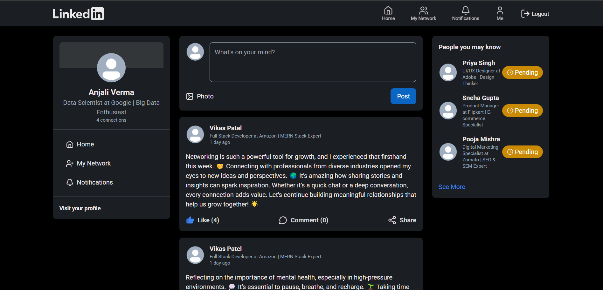
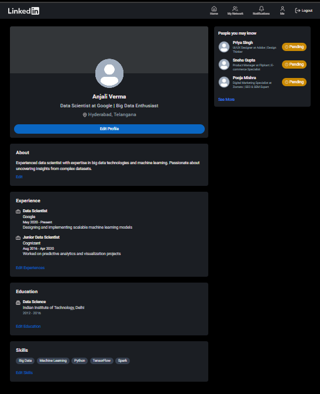
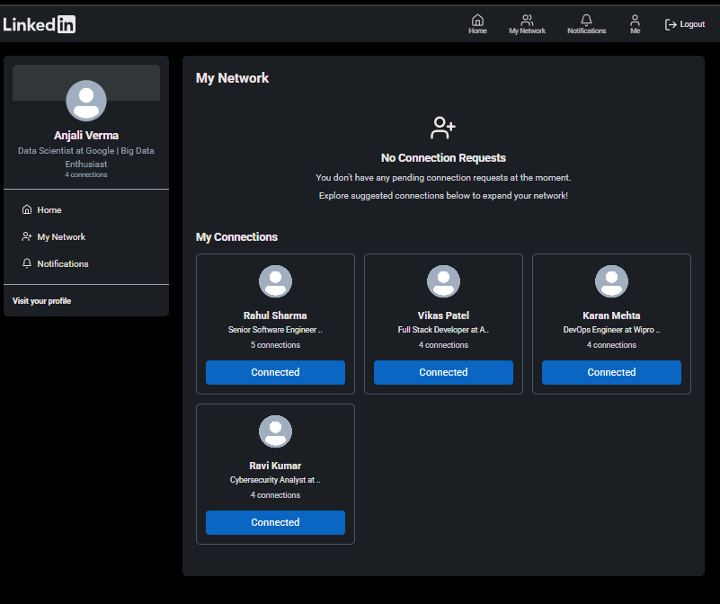
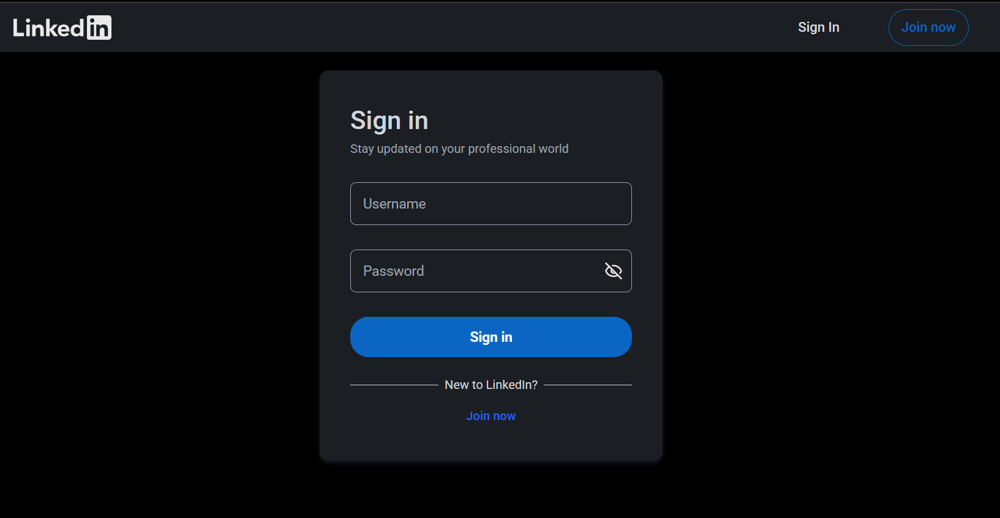
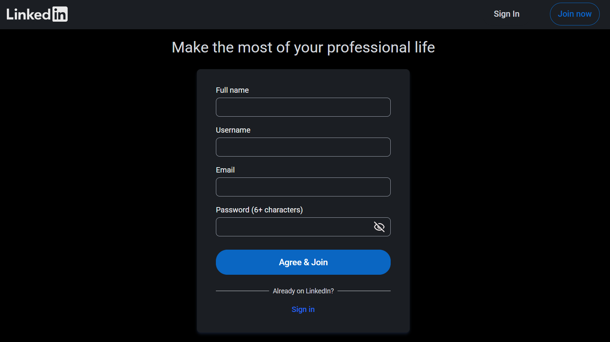

# LinkedIn Clone

## [View Site](https://linked-in-clone-liart.vercel.app/)

## Overview

LinkedIn Clone is a web application that mimics the core functionalities of LinkedIn, allowing users to connect, create posts, and manage their professional profiles. Built with React for the frontend and Node.js with Express for the backend, this project showcases modern web development practices.

### Features

- User authentication (signup, login, logout)
- Profile management (view and edit profiles)
- Connection requests (send, accept, reject)
- Post creation and management (like, comment, delete)
- Real-time notifications
- Responsive design using Tailwind CSS

## Technologies Used

- **Frontend:**
  - React
  - Vite
  - Tailwind CSS
  - DaisyUI
  - React-Query

- **Backend:**
  - Node.js
  - Express
  - MongoDB
  - Mongoose
  - Cloudinary (for image uploads)
  - JWT
  - Bcryptjs

## 🖼️ Screenshots
  
  
  
  
  

## Acknowledgments

- Inspired by LinkedIn
